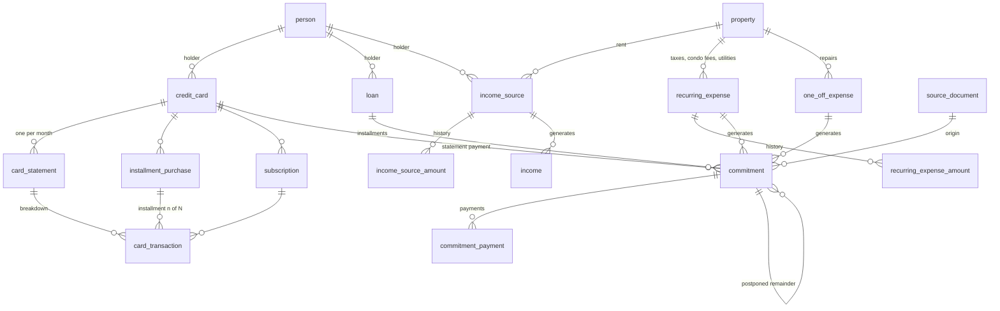

# Modelo de datos — Sistema de economía familiar

2 oct 2026 · v4 (validado) · Base: `docs/requisitos-funcionales.md` · Traducción: `docs/glosario-es.yml`

21 tablas en Postgres (Supabase), definidas con Drizzle. Tablas, columnas y enums en inglés; el texto del documento, en castellano. Los nombres en castellano de cada tabla, campo y valor de enum están en `glosario-es.yml`, que también sirve como fuente de etiquetas para la PWA.

## 1. Decisiones de diseño

**D1 · Lo futuro no se guarda: se calcula.**
Los compromisos e ingresos de meses futuros son *virtuales*: el Worker los calcula desde las reglas (fuentes de ingreso, gastos recurrentes, cuotas, préstamos, suscripciones). Se *materializan* (se graba la fila) solo cuando:
- se abre el mes en curso (al primer acceso del mes, el Worker graba todos sus compromisos e ingresos — esto es el RF-27),
- o algo los toca antes: un pago, una postergación, un monto real cargado por Claude.

Si se grabaran 12 meses por adelantado, cada cambio de monto, cotización o fecha de fin obligaría a regenerar filas sin pisar las editadas. Con virtuales, la proyección siempre está al día. La unión entre virtual y grabado se hace por `source_key` única (ver D5).

**D2 · Servicios, impuestos, expensas, recurrentes y rubros estimados son una sola tabla.**
Los tres conceptos de los requisitos (Servicio, Gasto recurrente, Gasto estimado) son una regla que genera un compromiso cada *k* meses, con monto estimado e historial. Van en `recurring_expense` con un campo `class` (utility, tax, condo_fee, recurring, budget). Los reportes filtran por clase.

**D3 · Lo que carga Claude no toca las tablas del dominio hasta que se confirma.**
Claude graba en `source_document` la *operación propuesta* (por ejemplo, `load_card_statement` con su payload). Al confirmar, el Worker ejecuta esa operación en una transacción, igual que si la hubiera hecho un usuario. Corregir = editar el payload antes de confirmar. La regla 12 se cumple por construcción.

**D4 · Una tarjeta genera dos compromisos por mes: uno en moneda local y otro en USD.**
Cada compromiso tiene una sola moneda y el modelo de pagos es el mismo para todo. El pago de la parte USD se registra en ARS (o UYU) con la cotización aplicada.

**D5 · Postergar mueve; pagar parcial y postergar el resto divide.**
- `period` = mes en el que cuenta el compromiso hoy. `origin_period` = mes para el que nació. Postergar cambia `period`; nunca `origin_period`.
- Si se paga una parte y el resto se posterga, la fila original queda pagada por lo pagado y se crea una hija (`parent_commitment_id`) con el resto en el nuevo mes.
- "Qué se postergó en octubre" = compromisos con `origin_period = oct` y `period > oct`. Postergado no es un estado guardado: es un hecho derivable. Los estados guardados son pending, partially_paid, paid y cancelled.

**D6 · Los meses son fechas.**
Todo período se guarda como `date` con día 1 (check `extract(day) = 1`).

**D7 · Periodicidad = cada k meses + mes ancla.**
`every_months` (1, 2, 3, 6, 12) y `anchor_month` (1–12). Mensual = 1; bimestral desde febrero = 2/2; anual en marzo = 12/3. Cubre la regla 8 sin casos especiales.

**Vigencia** (`valid_from` / `valid_to`): se compara por mes y los dos extremos cuentan. Algo con `valid_to` en diciembre tiene su último cargo en diciembre, aunque la fecha sea el 10; algo con `valid_from` el 15 de marzo rige desde marzo. Validado por Martín el 3/10.

**D8 · La simulación no tiene tablas.**
El Worker recibe la operación hipotética en el request, la suma a las reglas en memoria y devuelve la proyección. Confirmar = la misma llamada de alta de siempre.

## 2. Convenciones

- Inglés, `snake_case` en la base y `camelCase` en TypeScript (Drizzle mapea con `casing: 'snake_case'`). Tablas en singular.
- PK `id uuid default gen_random_uuid()` en todas las tablas (salvo `month`).
- Importes `numeric(14,2)`; cotizaciones e índices `numeric(14,6)` (RNF-10).
- Cada importe va acompañado de su `currency`. Nunca se convierte al guardar (regla 5).
- Valores de enum en minúscula, salvo códigos ISO (`ARS`, `USD`, `UYU`, `AR`, `UY`).
- **Columnas de auditoría** en todas las tablas de dominio (RF-01, carga automática):

| Campo | Tipo | Notas |
| --- | --- | --- |
| created_at / updated_at | timestamptz | default now() |
| created_by / updated_by | uuid → person | usuario autenticado |
| entry_mode | enum `entry_mode` | manual · claude |
| source_document_id | uuid → source_document, null | comprobante del que salió, si salió de uno |

  Precisiones del schema (E0): van en las 20 tablas salvo `source_document`, que es el comprobante mismo y solo tiene `created_at`/`updated_at` además de `uploaded_by` y `reviewed_by`. `created_by` y `updated_by` admiten null para lo que carga el sistema (seed, scripts de importación); `entry_mode` tiene default `manual`.

- **Checks** además de los unique: período con día 1 (D6) en `period`, `origin_period`, `from_period`, `first_period` e `income_source.valid_from`; `every_months in (1,2,3,6,12)` y `anchor_month` 1–12 (D7); días del mes 1–31; cuotas ≥ 1; `rate > 0` en cotizaciones; `credit_card.local_currency in (ARS, UYU)`; `loan.principal_uva` presente si y solo si `kind = uva`; `commitment` con exactamente un origen (`num_nonnulls` de las cuatro FK = 1). Nombres de constraints en `snake_case`.
- Las entidades maestras no se borran: tienen `active boolean` o fecha de fin. Los compromisos se anulan, no se borran.
- RLS activado sin políticas en todas las tablas (RNF-09).

## 3. Diagrama

Transversales sin relaciones fuertes: `category` (la usan casi todas), `exchange_rate`, `economic_index`, `month`.

## 4. Tablas

### 4.1 Base

**person** — titulares, usuarios y destinatarios.

| Campo | Tipo | Notas |
| --- | --- | --- |
| name | text | Martín, Rosalía, Amaia |
| email | text, null, unique | solo usuarios; es la lista blanca del login (RNF-07) |
| is_user | boolean | |

**category** (RF-06)

| Campo | Tipo | Notas |
| --- | --- | --- |
| name | text | en castellano: es dato, no identificador |
| kind | enum `category_kind` | income · expense |
| active | boolean | |
| | | unique(name, kind) |

**property** (RF-26)

| Campo | Tipo | Notas |
| --- | --- | --- |
| name | text | |
| country | enum `country` | AR · UY |
| currency | enum `currency` | moneda en la que se piensa la propiedad |
| active | boolean | |

**exchange_rate** (RF-04, regla 6)

| Campo | Tipo | Notas |
| --- | --- | --- |
| pair | enum `currency_pair` | USD_ARS · UYU_USD |
| valid_from | date | puede ser anterior a la carga |
| rate | numeric(14,6) | |
| | | unique(pair, valid_from) |

Cotización vigente a una fecha = la fila con mayor `valid_from ≤ fecha`. UYU → ARS pasa por USD.

**Sentido de `rate`** (decidido el 3/10): en los dos pares es cuántas unidades de moneda local vale un dólar, como lo informan bancos y diarios. `USD_ARS` = pesos argentinos por USD (≈ 1.450); `UYU_USD` = pesos uruguayos por USD (≈ 40). El nombre del par no indica el sentido; manda esta definición.

**economic_index** (RF-05, RF-24)

| Campo | Tipo | Notas |
| --- | --- | --- |
| kind | enum `index_kind` | cpi · uva |
| date | date | IPC: día 1 del mes · UVA: fecha del valor |
| value | numeric(14,6) | IPC: nivel del índice del mes (base INDEC) · UVA: valor en pesos del día |
| | | unique(kind, date) |

Pesos constantes: monto × (IPC del mes de referencia / IPC del mes del monto).

**month** — control de apertura y cierre.

| Campo | Tipo | Notas |
| --- | --- | --- |
| period | date, PK | día 1 |
| status | enum `month_status` | open · closed |
| opened_at / opened_by | timestamptz / uuid → person | cuándo se materializó (D1) |
| closed_at / closed_by | timestamptz, null / uuid, null | cerrado = el resultado real ya es definitivo |

### 4.2 Ingresos

**income_source** (RF-07)

| Campo | Tipo | Notas |
| --- | --- | --- |
| name | text | "Sueldo docente Martín", "Alquiler Pocitos" |
| category_id | → category | |
| holder_id | → person, null | informativo (RF-02) |
| property_id | → property, null | obligatorio para alquileres; alimenta rentabilidad por propiedad |
| currency | currency | |
| every_months / anchor_month | smallint / smallint | D7 |
| expected_day | smallint, null | día esperado de cobro |
| valid_from | date | período |
| valid_to | date, null | null = indefinida (regla 11) |

**income_source_amount** — historial (regla 7)

| Campo | Tipo | Notas |
| --- | --- | --- |
| income_source_id | → income_source | |
| from_period | date | rige desde ese mes hasta la próxima fila |
| amount | numeric(14,2) | en la moneda de la fuente |
| | | unique(income_source_id, from_period) |

Reglas de carga (E1): la fuente se da de alta con su primer monto, que rige desde `valid_from`, en la misma transacción. Siempre tiene que haber un monto que rija en el primer mes de la fuente: no se acepta mover `valid_from` antes del primer monto ni correr el primer monto después de `valid_from`. La categoría tiene que ser de ingresos. Dar de baja una fuente = cargar `valid_to` (último mes que se cobra, inclusive); los meses ya grabados conservan sus ingresos (D1).

**income** — ingreso esperado materializado, o ingreso puntual (RF-08, RF-09)

| Campo | Tipo | Notas |
| --- | --- | --- |
| income_source_id | → income_source, null | null = puntual (extra, proyecto Adavra, suplencia) |
| source_key | text, null, unique | `is:<id>:<period>`; null en puntuales |
| description | text | copia de la fuente o texto libre |
| category_id | → category | |
| period | date | |
| expected_date | date, null | |
| currency | currency | |
| estimated_amount | numeric(14,2) | |
| actual_amount | numeric(14,2), null | |
| received_date | date, null | |
| applied_rate | numeric(14,6), null | se fija al cobrar |
| status | enum `income_status` | expected · received · cancelled |

### 4.3 Tarjetas

**credit_card** (RF-10)

| Campo | Tipo | Notas |
| --- | --- | --- |
| name | text | "Visa Provincia Martín" |
| bank | text | |
| country | country | |
| holder_id | → person | |
| local_currency | currency | ARS o UYU; también es la moneda de pago (regla 3) |
| closing_day / due_day | smallint | aproximados; el real viene en el resumen |
| estimated_spend_local | numeric(14,2) | para estimar resúmenes futuros (RF-16) |
| estimated_spend_usd | numeric(14,2) | |
| active | boolean | |

**card_statement** — solo resúmenes reales; los futuros son virtuales (RF-11, RF-16)

| Campo | Tipo | Notas |
| --- | --- | --- |
| credit_card_id | → credit_card | |
| period | date | mes en que vence |
| closing_date / due_date | date | |
| previous_balance_local / previous_balance_usd | numeric(14,2) | lo no pagado del anterior (regla 4) |
| total_local / total_usd | numeric(14,2) | |
| minimum_payment_local | numeric(14,2) | |
| | | unique(credit_card_id, period) — también frena duplicados de Claude |

Monto pagado y saldo financiado no se guardan: salen de los pagos de sus dos compromisos.

**installment_purchase** — compra en cuotas; sus cuotas se proyectan (RF-13)

| Campo | Tipo | Notas |
| --- | --- | --- |
| credit_card_id | → credit_card | |
| description | text | |
| category_id | → category | |
| purchase_date | date | |
| currency | currency | |
| installment_amount | numeric(14,2) | |
| installments_total | smallint | |
| first_period | date | resumen donde cae la cuota 1 |

Al arrancar (RNF-15) se carga con el número de cuota del último resumen: si el resumen de octubre dice "4 de 12", `first_period` = julio.

**subscription** — suscripciones y débitos automáticos en tarjeta (RF-14)

| Campo | Tipo | Notas |
| --- | --- | --- |
| credit_card_id | → credit_card | |
| description | text | "Celular Ro" |
| category_id | → category | |
| currency | currency | |
| amount | numeric(14,2) | se actualiza con el último resumen |
| valid_from / valid_to | date / date, null | valid_to = baja |

**card_transaction** — desglose del resumen real (RF-12)

| Campo | Tipo | Notas |
| --- | --- | --- |
| card_statement_id | → card_statement | |
| kind | enum `card_transaction_kind` | purchase · installment · subscription · interest · admin_fee · tax · payment · adjustment |
| date | date, null | |
| description | text | |
| category_id | → category, null | |
| currency | currency | |
| amount | numeric(14,2) | negativo para pagos y bonificaciones |
| installment_purchase_id | → installment_purchase, null | si es cuota |
| installment_number | smallint, null | |
| subscription_id | → subscription, null | |

Costo financiero de tarjetas = suma de `interest + admin_fee + tax` por tarjeta y mes.

### 4.4 Gastos

**recurring_expense** — servicios, impuestos, expensas, recurrentes fuera de tarjeta y rubros estimados (D2; RF-17, RF-18, RF-20)

| Campo | Tipo | Notas |
| --- | --- | --- |
| name | text | "Luz", "ARBA", "Mesada Amaia", "Súper" |
| class | enum `expense_class` | utility · tax · condo_fee · recurring · budget |
| provider | text, null | Edelap, APR, ARBA… |
| category_id | → category | |
| property_id | → property, null | |
| beneficiary_id | → person, null | destinatario (mesada de Amaia) |
| currency | currency | |
| every_months / anchor_month | smallint | D7; anual = 12 + mes de pago |
| due_day | smallint, null | |
| valid_from / valid_to | date / date, null | |

**recurring_expense_amount** — historial de montos estimados (RF-19)

| Campo | Tipo | Notas |
| --- | --- | --- |
| recurring_expense_id | → recurring_expense | |
| from_period | date | |
| amount | numeric(14,2) | |
| | | unique(recurring_expense_id, from_period) |

Cargar la factura real de un servicio actualiza el compromiso del mes y, si se elige, agrega una fila acá desde el mes siguiente (RF-19).

**one_off_expense** — gasto puntual (RF-21)

| Campo | Tipo | Notas |
| --- | --- | --- |
| description | text | |
| category_id | → category | |
| property_id | → property, null | |
| currency | currency | |
| total_amount | numeric(14,2) | |
| installments | smallint, default 1 | pagos fuera de tarjeta; si va con tarjeta es una `installment_purchase` |
| first_period | date | puede ser futuro |
| planned_date | date, null | |

Cuota = total / cuotas; la última absorbe el redondeo.

### 4.5 Préstamos

Al dar de alta el préstamo se cargan sus condiciones y el sistema calcula el cuadro de amortización teórico (no se graba: se recalcula). Mes a mes solo se carga el importe real de la cuota, en `commitment.actual_amount`.

**loan** (RF-22, RF-25)

| Campo | Tipo | Notas |
| --- | --- | --- |
| lender | text | entidad |
| holder_id | → person | |
| category_id | → category | |
| currency | currency | |
| kind | enum `loan_kind` | fixed_rate · uva |
| amortization_system | enum `amortization_system` | french · german · american |
| principal | numeric(14,2) | capital otorgado |
| principal_uva | numeric(14,6), null | solo UVA: capital en UVAs al otorgamiento |
| nominal_annual_rate | numeric(9,6) | TNA en %, como figura en el contrato; en UVA, tasa sobre el capital ajustado |
| effective_annual_rate | numeric(9,6), null | TEA, informativa |
| total_financial_cost | numeric(9,6), null | CFT informado (con IVA), informativo |
| interest_vat_rate | numeric(5,2), default 0 | alícuota de IVA sobre intereses, en % |
| monthly_insurance | numeric(14,2), default 0 | seguro de vida u otro cargo fijo por cuota |
| granted_date | date | fecha de otorgamiento; define el primer período de interés |
| installments_total | smallint | |
| first_period | date | mes de la cuota 1 |
| due_day | smallint | día de vencimiento; si el mes tiene menos días (p. ej. 31), vence el último día del mes |
| quoted_installment | numeric(14,2), null | cuota que informó el banco al otorgar |

**Cálculo y control**

- **Cuota teórica n** (convención validada al centavo contra 8 cuotas reales de un préstamo bancario, 3/10):
  - **Capital** según el sistema: francés = cuadro de libro con tasa mensual TNA/12 (cuota pura constante); alemán = capital / n; americano = todo el capital en la última cuota.
  - **Interés** por los días reales del período sobre el saldo de capital: tasa del período = TNA × días / 365, redondeada a 8 decimales; interés = saldo × tasa del período, truncado a centavos. El primer período va de `granted_date` al primer vencimiento; los siguientes, entre vencimientos. Por eso la cuota varía con los días del mes y la primera es mayor si el otorgamiento es más de un mes antes.
  - Vencimientos: `first_period` + `due_day` (31 = último día de cada mes).
  - IVA = interés × `interest_vat_rate`; más `monthly_insurance`. Capital redondeado a centavos; la última cuota toma el saldo que quede, así el préstamo cierra en cero.
  - En UVA se calcula en UVAs y se pasa a pesos con el valor UVA del vencimiento (o el último cargado, para cuotas futuras: RF-24).
- **Cuotas por fecha, no por número.** Los avisos del banco se emparejan con la cuota del cuadro por la fecha de vencimiento: los bancos numeran distinto (algunos cuentan el desembolso como cuota 1).
- **Cuota estimada** de los compromisos futuros = cuota teórica. No se carga a mano.
- **Desvío por cuota** = monto real − cuota teórica, en importe y en %. Detecta que algo no cierra; para saber qué, hay que mirar el aviso del banco.
- **Deuda remanente (RF-25)** = saldo de capital del cuadro teórico después de la última cuota pagada.
- **Desvío típico:** el banco cobra aparte "intereses exceso" (compensatorio + punitorio, 1,5 × TNA, por los días de atraso) cuando la cuota se debita después del vencimiento. Aparece como desvío positivo.
- Las fórmulas viven en `packages/domain/src/loan.ts` (RNF-11): francés con un préstamo inventado que sigue la misma convención; la validación contra las cuotas reales vive en un test local fuera de git (`*.local.test.ts`), porque el repo es público. Alemán, americano y UVA contra ejemplos calculados a mano. El préstamo de Rosalía se valida cuando estén sus datos.
- **Pendiente (otros bancos):** si un préstamo de otro banco calcula distinto, agregar la opción de dividir el monto total en n cuotas iguales, sin cuadro. Se decide al cargar ese préstamo.

### 4.6 Compromisos

**commitment** — compromiso de pago, la unidad central (RF-27, RF-28)

| Campo | Tipo | Notas |
| --- | --- | --- |
| source_key | text, null | `re:<id>:<period>` · `cc:<id>:<period>:<currency>` · `oe:<id>:<n>` · `ln:<id>:<n>`; null en hijos de división |
| credit_card_id | → credit_card, null | exactamente uno de los cuatro (check) |
| recurring_expense_id | → recurring_expense, null | |
| one_off_expense_id | → one_off_expense, null | |
| loan_id | → loan, null | |
| installment_number | smallint, null | préstamos y gastos puntuales |
| parent_commitment_id | → commitment, null | resto de un pago parcial postergado (D5) |
| description | text | copia al materializar |
| category_id | → category | |
| origin_period | date | mes de origen; no cambia |
| period | date | mes en que cuenta hoy; cambia al postergar |
| due_date | date, null | |
| currency | currency | |
| estimated_amount | numeric(14,2) | |
| actual_amount | numeric(14,2), null | factura o resumen real (regla 10) |
| surcharge | numeric(14,2), default 0 | recargo o interés por postergar o pagar parcial (RF-29) |
| status | enum `commitment_status` | pending · partially_paid · paid · cancelled |
| cancellation_reason | text, null | ej.: "pagado con tarjeta" (regla 2) |

Índices: unique(`source_key`); (`period`, `status`); (`origin_period`).
Monto vigente = `coalesce(actual_amount, estimated_amount) + surcharge`.

**commitment_payment** — uno o varios pagos por compromiso (RF-15, RF-28, regla 6)

| Campo | Tipo | Notas |
| --- | --- | --- |
| commitment_id | → commitment | |
| date | date | |
| payment_currency | currency | ARS/UYU aunque el compromiso sea USD |
| amount_paid | numeric(14,2) | en payment_currency |
| applied_rate | numeric(14,6), null | null si no hubo conversión; queda fija |
| allocated_amount | numeric(14,2) | imputado, en la moneda del compromiso |
| payment_method | enum `payment_method` | transfer · debit · cash · mercado_pago · other |

Estado: suma de `allocated_amount` ≥ monto vigente → paid; > 0 → partially_paid. Lo calcula el Worker en la misma transacción del pago.

### 4.7 Carga por Claude

**source_document** — comprobante: bandeja de revisión y control de duplicados (D3; RF-35)

| Campo | Tipo | Notas |
| --- | --- | --- |
| file_name | text | el archivo no se guarda |
| file_hash | text, unique | SHA-256: el mismo archivo dos veces se rechaza |
| kind | enum `document_kind` | card_statement · utility_bill · loan_notice · tax · condo_fee · payment_receipt · other |
| operation | text, null | herramienta del dominio a ejecutar (`load_card_statement`…) |
| payload | jsonb, null | datos extraídos, con la forma de entrada de esa operación |
| status | enum `document_status` | pending_review · unrecognized · confirmed · discarded |
| reason | text, null | por qué no se reconoció o se descartó |
| uploaded_by | → person | usuario cuyo Claude lo subió |
| reviewed_by / reviewed_at | → person / timestamptz, null | |

Bandeja = `pending_review` y `unrecognized`. Confirmar ejecuta `operation(payload)` en una transacción y deja `source_document_id` en todo lo que creó o modificó. Un comprobante de pago se resuelve como `register_payment` sobre el compromiso existente, nunca como gasto nuevo.

## 5. Enums

| Enum | Valores |
| --- | --- |
| currency | ARS · USD · UYU |
| country | AR · UY |
| currency_pair | USD_ARS · UYU_USD |
| index_kind | cpi · uva |
| entry_mode | manual · claude |
| category_kind | income · expense |
| month_status | open · closed |
| income_status | expected · received · cancelled |
| commitment_status | pending · partially_paid · paid · cancelled |
| expense_class | utility · tax · condo_fee · recurring · budget |
| card_transaction_kind | purchase · installment · subscription · interest · admin_fee · tax · payment · adjustment |
| loan_kind | fixed_rate · uva |
| amortization_system | french · german · american |
| payment_method | transfer · debit · cash · mercado_pago · other |
| document_kind | card_statement · utility_bill · loan_notice · tax · condo_fee · payment_receipt · other |
| document_status | pending_review · unrecognized · confirmed · discarded |

## 6. Reglas de negocio → dónde viven

| Regla | Cómo la garantiza el modelo |
| --- | --- |
| 1 · Sin doble conteo | Lo de tarjeta solo existe como `card_transaction`; el compromiso apunta a `credit_card_id`, nunca a la suscripción. `recurring_expense` no tiene campo de tarjeta. |
| 2 · Recurrente pagado con tarjeta | Ese mes el compromiso del recurrente se anula con `cancellation_reason` y el gasto queda como movimiento del resumen. |
| 3 · Moneda de pago de tarjetas | `credit_card.local_currency` + `commitment_payment.payment_currency` y `applied_rate`. |
| 4 · Pago parcial de tarjeta | Lo no imputado aparece en `previous_balance_*` del resumen siguiente; los intereses, como `card_transaction` de tipo `interest`. |
| 5 · Moneda original | Todo importe tiene su `currency`; no hay columnas convertidas. |
| 6 · Cotización vigente | Conversión al mostrar contra `exchange_rate`; los pagos guardan `applied_rate` y no se recalculan. |
| 7 · Montos vigentes | Tablas `*_amount` con `from_period`. |
| 8 · Impuestos anuales | `every_months = 12` + `anchor_month`. |
| 9 · Sin arrastre | No existe ningún saldo de mes; solo se mueven compromisos (`period`). |
| 10 · Estimado contra real | `estimated_amount` y `actual_amount` conviven; la diferencia se calcula. |
| 11 · Fin automático | `valid_to`, `installments_total`; el generador no produce nada fuera de rango. |
| 12 · Confirmación humana | Nada de Claude entra al dominio sin pasar por `source_document` → confirmar (D3). |

## 7. Cómo se calcula un mes

Para cada mes M de la proyección, el Worker:

1. Lee lo grabado: compromisos e ingresos con `period = M` y estado distinto de cancelled.
2. Genera los candidatos virtuales de M desde todas las reglas vigentes (fuentes de ingreso, gastos recurrentes, gastos puntuales, préstamos, y por tarjeta: cuotas + suscripciones + consumo estimado, o el resumen real si existe).
3. Descarta los candidatos cuya `source_key` ya está grabada (aunque esté en otro mes porque se postergó, o anulada).
4. Suma: resultado estimado = ingresos − compromisos, convirtiendo cada importe con la cotización vigente a su fecha. El resultado real (meses cerrados) usa montos cobrados y `allocated_amount` de los pagos.

**Precisiones de la generación** (`packages/domain/src/generators.ts`, 3/10):
- **Tarjetas:** un compromiso por moneda (D4), local y USD. Si una moneda no tiene nada que pagar en el mes, no se genera su compromiso (una tarjeta sin consumos en USD tiene un solo compromiso). Con resumen real cargado se usan sus totales y su vencimiento; si no, cuotas que caen en el mes + suscripciones vigentes + consumo estimado. Una tarjeta inactiva sigue generando sus cuotas y suscripciones pendientes, pero no el consumo estimado. Una compra o suscripción en una moneda que la tarjeta no factura es un error de datos.
- **Categoría del pago de tarjeta:** `credit_card` no tiene categoría y `commitment.category_id` es obligatorio, así que el pago de los resúmenes usa la categoría de gasto **"Tarjetas de crédito"**, que crea el seed (decidido por Martín el 3/10). Se busca por nombre: no renombrarla. El detalle por rubro de lo comprado con tarjeta sale de `card_transaction`.
- **Sin monto vigente:** si una fuente de ingreso o un gasto recurrente no tiene monto cargado para el mes, no se genera el candidato y se informa como aviso (no se descarta en silencio). Igual con un préstamo UVA sin valor UVA cargado.
- **Gasto puntual en cuotas:** la fecha prevista se aplica a la primera cuota; las demás quedan sin vencimiento.

Con ~50 reglas y 12 meses son unas 600 operaciones en memoria: entra cómodo en los 10 ms de CPU del Worker. Las consultas son 6–8 por proyección, no una por mes.

Abrir un mes es idempotente gracias al unique de `source_key`: si dos usuarios entran a la vez, el segundo no duplica.

**Proyección** (`packages/domain/src/projection.ts`, servicio `apps/worker/src/services/projection.ts`, 3/10):
- Cada mes = compromisos e ingresos grabados con `period` en el mes (no anulados) + candidatos virtuales cuya `source_key` no está grabada. Monto vigente del compromiso = `coalesce(actual_amount, estimated_amount) + surcharge`; del ingreso, `coalesce(actual_amount, estimated_amount)`. "Postergado" se deriva de `origin_period ≠ period`.
- Totales en cada moneda original (siempre) y convertidos a ARS y USD con la cotización vigente a la fecha de cada línea (vencimiento o fecha esperada; si no tiene, el día 1 del mes). Si falta una cotización, los totales convertidos quedan vacíos y se informa qué par y fecha faltan, sin cortar la proyección.
- **Carga de cuotas (RF-33)** = (cuotas de compras con tarjeta que caen en el mes + cuotas de préstamos) en ARS ÷ ingresos del mes en ARS. Sin ingresos, el porcentaje queda vacío.
- Solo lectura: proyectar no materializa nada. Horizonte de 1 a 36 meses.

Implementación (`apps/worker/src/services/open-month.ts`): en una sola transacción se inserta la fila de `month` con `ON CONFLICT DO NOTHING`; si ya existía, no se hace nada más. Si es nueva, se generan los candidatos del mes y se insertan con `ON CONFLICT (source_key) DO NOTHING`, así lo ya grabado (tocado antes, postergado o anulado) nunca se pisa ni se duplica. Las reglas que no pudieron generar (sin monto vigente, UVA sin valor) vuelven como avisos.

## 8. Fuera de este modelo (a propósito)

- **Cuentas, saldos y transferencias**: fuera de alcance.
- **Archivos adjuntos (RF-36)**: futuro; cuando llegue, una tabla `attachment` polimórfica + Supabase Storage.
- **Log de cambios campo por campo**: hoy alcanza con created/updated by. Si hace falta "quién cambió este monto y cuándo", se agrega una tabla de eventos.
- **Subcategorías**: no se pidieron; agregar `parent_id` a `category` es trivial si hace falta.

## 9. Estado

Validado el 2/10: D1 a D8; IPC como nivel del índice; préstamos con tasa y sistema de amortización, cuota teórica calculada y solo el importe real cargado mes a mes; identificadores en inglés con traducción en `glosario-es.yml`.

Schema de Drizzle en `packages/db/src/schema.ts` y primera migración en `packages/db/migrations/0000_init.sql` (E0).
